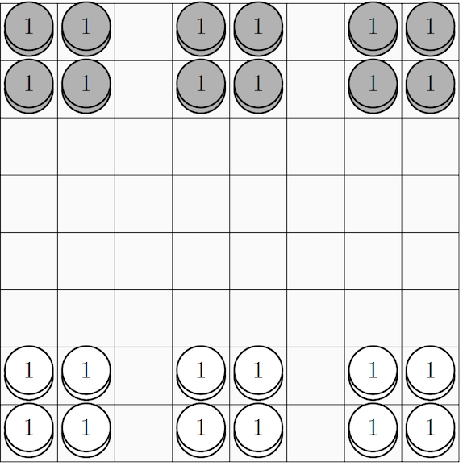
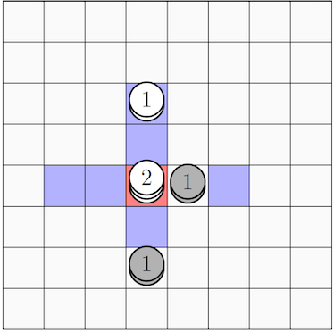
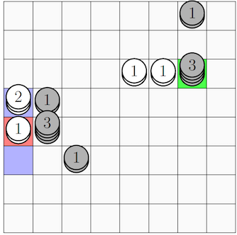
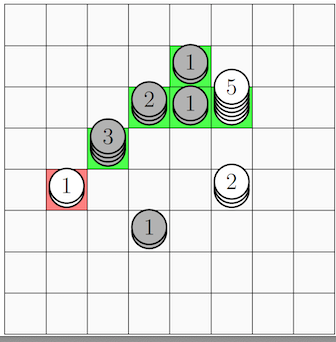

# Expendibots Game Rules
Expendibots is a fast paced action game where assembling and disassembling powerful stacks of bots will
be the key to your survival. Sneak behind enemy lines and cause chain reactions to do huge damage, but
watch out for friendly fire! Can you successfully fend off your opponent's attacks and emerge victorious?

## Setup
Expendibots is played on a 8X8 board consisting of 64 squares, as illustrated in Figure 1. Two players, White
and Black, play the game. Each player initially controls 12 tokens of their own colour. The pieces begin in
the configuration shown below in Figure 1, occupying the back two rows in 3 square formations. One or more
tokens of the same colour on a single square form a stack; for ease of rendering in 2D, we depict the number of
tokens in a stack by a number placed on the token in the diagram. In the initial position, all stacks are of size 1
(a single token).

## Game Play
Players alternate taking turns, with White having the first turn. This cycle repeats until the game ends. On
each turn, the current player must take a single action involving a stack of their colour. This action may be a
move action or a boom action. Each type of action is described in the following sections.

### Move Action
A move action (a 'move') involves moving some or all of the tokens in a stack some number of squares in one
of the four cardinal directions | up, down, left, or right. From a stack of n tokens (n >= 1), the player may move
up to n of those tokens a distance of up to n squares in a single direction. The tokens may not move diagonally,
and must move by at least one square. The destination square may be unoccupied, or it may already be occupied
by tokens of the same colour | in this case, the moved tokens join the tokens on the destination square, forming
a new stack whose number of tokens is equal to the number of tokens originally on the square plus the number
of tokens moved onto the square. The tokens may not move onto a square occupied by the opponent's tokens.
However, the tokens may move 'over' it (as long as the total distance moved is not more than n squares). A
token cannot move off the board. There is no limit to the number of tokens in a stack.

* The stack marked with red has 2 tokens. Thus, the player may move one or both of these tokens up to 2
squares in any of the cardinal directions. The player has 12 possible move actions it could take with this
stack|moving 1 or 2 tokens to any of the 6 squares marked in blue. Note that the squares already occupied
with opposing tokens cannot be the destination for this move.

* The stack marked with red only consists of a single token, so it can only move a single square in the cardinal directions.
It cannot move off the board or onto a stack of a different colour, so it can only has 2 possible
moves (to the squares marked in blue). If it were to move up, the square above would then have a single
white stack of 3 tokens. Quiz: The stack marked in green has 21 distinct move actions it could make, can you find them all?

### Boom Action
A boom action (a 'boom') involves choosing a stack to explode. All of the tokens in this stack are removed from
play as a result of this explosion. Additionally, the explosion immediately causes any stacks (of either color) in
a 3x3 area surrounding this stack to also explode. These explosions may go on to trigger further explosions in
a recursive chain reaction. In this way, long chains of stacks may be removed from play as the result of a single
action.

* If the White player chooses to explode the stack marked in red, all the tokens in the 3x3 blue zone
will also explode. In this case, this would result in the removal of all tokens on the board.

* If the White player chooses to explode the stack marked in red, the Black 3-stack will be caught in the
explosion. This 3-stack will also explode, causing the Black 2-stack to explode, followed by the nearby Black
1-stacks, and finally the White 5-stack. This would result in all the stacks marked in red or green to be
removed from play. The White 2-stack and the lower-most Black 1-stack are not in the range of any of the
explosions, so they would not be affected by the action.

## Ending the Game
The game ends as soon as at least one player has no remaining tokens. At this point, the player who still has at
least one token is declared the winner. If both players lose their remaining tokens simultaneously, the game is
declared a draw. A draw is also declared if either of the following conditions are met:
* One board configuration (with all stacks in the same position and quantity) occurs for a fourth time since
the start of the game. These repeated board configurations do not need to occur in succession.
* Each player has had their 250th turn without a winner being declared.