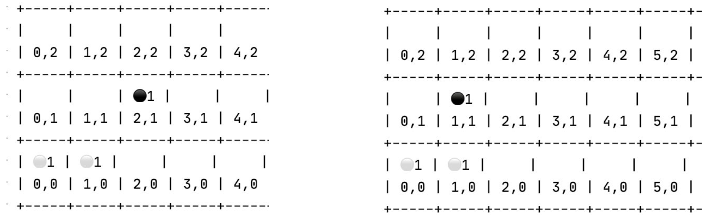

# Approximate Q-learning Agent
To play the expendibots game, we designed an approximate Q-learning agent to decide
which actions to take throughout the game.

## The Approximate Q-Learning Algorithm
Q-learning is a reinforcement learning method, it aims to maximize the total reward. It
maintains a set of Q-values for every action of each state in the system. These Q-values are
the estimated reward of taking those actions in the corresponding states, it indicates how
promising an action for a state might be.
In our approximate Q-learning algorithm, we identify a set of features to describe the states
in a system and assign a weight to each feature. Therefore, each state in the system can be
represented as a linear function of the weighted features. And we adopted the linear function
of a state as the Q-value of the action that leads to this state in its previous state.
Therefore, the Q-value of the action a in state s can be expressed as the equation below:

$$Q(s, a) = \sum weight_i(s') * feature_i(s')?

Before each round, our agent calculates Q-values of each action in a state using the
weighted features of its successors and chooses which action to take according to their
Q-values. After each round, it goes back to calibrate the weights based on the actual reward
after taking that action. Here is the formula that our agent uses to update weights:

$$weight_i′ = weight_i + α (reward + γ * max(Q-value) − Q-value(action) ) * feature_i?

This formula will be used each time after we get our opponent’s response to our last move
(at the end of each round). The max(Q-value) in the equation refers to the max Q-value of
all actions from the old state, the Q-value(action) refers to the weighted features for the next
state after we perform our last move. And the reward is calculated by the updated state after
our opponent responds to our last move.
We apply this formula to each pair of weights and feature after each round so that the
weights to each feature can get calibrated.
Specifically, the ɑ in this function is the learning rate. It decides how fast the new information
overrides the old ones. A lower ɑ will lead to a slower learning of new information than the
learning speed of a higher ɑ . And in the extreme case where ɑ = 0, the agent will stop
learning, And the ɣ is called the discount factor. It affects the importance of future rewards.
An episode is an execution from the initial state to final state. It is expected that after enough
episodes, the weights will become stable and converge into a certain set of values.

## Our Approximate Q-Learning Agent
### Q-Value: The Evaluate Function
In our implementation, we obtained a set of features that can assess the state of the game
and assigned an initial weight to each of these features. Therefore, we can represent each
state using a linear function of its weighted features. And we used the results of those
linear functions to express the Q-values in this system. i.e.
$Q(s_t, a_t) = \sum(weight_i(s_t) * feature_i(s_t+1))$ Now let’s have a look at how our Q-learning is
performed.

#### To start on:
* Initialize the board and the board assistive data(board-util-data.json) which pre-calculate the cardinal reachability and surrounding cells of each cell
* Load the json files which store the weight factor, which are the learning result of the features.
* Initialize the key parameters of the agent including the learning rate, reward decay
and ε-greedy. The default value is α = 0.01, γ = 0.9, ε = 0.9.

#### To take actions:
When the agent is asked to take an action, there are 2 modes for the player to choose
actions.
* In ultimate game mode, it will iterate through all possible actions, calculate the
Q-value for each of these actions by using the evaluate function, and choose the
action with the maximum value.
* In learning mode, we use the ε-greedy factor to choose whether to take a random
action or choose the best Q-value action. For example, with ε = 0.9, we have 90% to
choose actions as we do in ultimate game mode, and 10% choose a random valid
action.
#### To update:
* After each turn, we update the state by applying the latest move to our board.
* After each round(both players have taken an action), we calculate the reward for the
last round based on our rewarding criteria. And then we apply the Bellman equation
to revise the estimation.
* Save the final weight vector to a file after a game finishes.  

In this way, after several episodes, our agent can be trained smarter after acquiring a set of
revised weights that can be used to guide the estimation.

## Key Features
As mentioned above, the function we used to calculate Q-value for each action of a state is a
linear function with a set of features as their corresponding weight. Therefore the accuracy of
the estimation largely depended on the quality of the features.
The features are used to represent the properties of the states. And we hoped that our
features could correctly describe our situations in the game playing and guide our agent on
its behavior. To achieve this, we identified the following features for our system.

1. **token-diff** : #our_tokens - #opponent_tokens.  
As the aim of the game is to eliminate our opponent’s token, this feature directly represents
our situation in its current state. While the agent tries to achieve a higher score for this
feature, it will be encouraged to diminish as much of the opponent's token as possible.

2. **marginal-rate** : #our_tokens_at_edge / #our_tokens  
This feature is the percentage of our tokens that are at the edge of the board in all our
tokens. This feature is to motivate the tokens to move away from the edge and come to the
center areas so that they can have a chance to kill more opponent tokens.

3. **cornered-rate** : #our_token_at_edge / #our_tokens  
This feature is very similar to the previous one, it is the percentage of our tokens that are at
the corner of the board in all our tokens. This feature also aims to motivate the tokens to
come to the center areas of the board.

4. **average-stack-score** : average size of our stacks  
This feature shows the average size of our stacks. We want to encourage the tokens to form
larger stacks for them to move further.

5. **early-non-bottom-num** : #our_token_at_bottoms  
This feature will only apply to the fist 13 turns, it aims to force our tokens to move forward at
the beginning of the game

6. **max-own-partition-token-diff**: max (#opponent_token - #our_token) in partitions  
A partition is a boom zone where all tokens within the zone will boom together. This feature
aims to form a partition with more opponent tokens and less our tokens. We want to make
the difference as large as possible to gain the most when booming such partitions.

7. **max-opponent-partition-token-diff**: max (#our_token - #opponent_token) in partitions  
This feature is a reversed version of the previous feature. We do not want to form a partition
where our tokens outweigh the opponent tokens.  
In practice, the weight of this feature is almost as high as token-diff, and times higher than
max-own-partition-token-diff, because if a max-opponent-partition-token-diff value occurs, it
pretty much guarantees that your partition will be eliminated by opponent in the next step,
however, when a high max-own-partition-token-diff value occurs, the opponent still has one
step to avoid it.

8. **own-vulnerability-reachability**: max(vulnerability score of our vulnerable spots)   
A partition is surrounded by empty cells, we call these empty cells as “vulnerable spots”,
each vulnerable spot has a “vulnerable value”, which means how many tokens in the
partition contact with this spot directly.

For example, in the left picture, `(2, 1)` is contacted with `(1, 0)`, while in the right picture, `(1, 1)`
is contacted with `(0, 0)` and `(1, 0)`. Therefore, for `(1, 1)` the vulnerable value would be 2, the
white tokens have no way to escape, but for `(2,1)` vulnerable value would be 1, the white can
avoid by taking `(“MOVE”, 1, (1,0), (0,0))` or `(“MOVE”, 1, (1, 0), (2,0))`. The vulnerable value
shows how dangerous a vulnerable spot is.  
We also calculate is there an opponent stack can reach our vulnerable spots, if so, how
much token difference can it cause if it booms at the spot. The vulnerable value indicates a
probability that the partition will be successfully killed. We estimate by hand that, for value 1,
the probability is 20%-30%, for value 2, it is 50%-60%, etc.  
Finally, we calculate a score by multiplying the probability from vulnerable value and the
token difference, which is the “vulnerability score”. The score indicates the expected token
number difference will be caused.

9. **opponent-vulnerability-reachability** : max(vulnerability score of opponent vulnerable
spots)  
This feature is a contrary to the previous one. It refers to the max vulnerable score for the
spots in all of our opponent’s vulnerable zones. We want to make this value as large as
possible to eliminate more opponent tokens.

10. **opponent-leftover-chasing** : 3 / <steps to get to the nearest opponent token>    
This feature is applied when we cannot reach any of our opponent’s vulnerable spots and
when we have advantages on token numbers. If these two conditions are met, the value of 
the feature equals to 3 / <steps it takes to get to the nearest opponent token>. This feature is
designed to encourage our token to chase the opponent’s vulnerability zone when we are in
advantage. 

## Rewarding Criteria
While the Q-value in our system can be seen as an assessment to the state right after our
agent took action, the reward in our system is an assessment after we receive the response
of our last move from our opponent.  
We use the technique of Reward Shaping to give extra reward or punishment to intermediate
actions, which is helpful to guide the training direction and calibrate the weights of features.
And we have the following rewarding criteria in the system:  
* `token_diff_score`:    
Score = #opponent_tokens_we_killed - #our_token_get_killed + bonus - punish  
If we win the game with more tokens than our opponent before this round starts and left with
no tokens, we get a 2.5 bonus. Otherwise we get a 5 bonus for winning the game.
If we lose the game, 5 points will be deducted. and if we lose more tokens than our enemy in
the round, we will be allotted 2 penalty points.  
* `stack_score`:   
Score = stack_size_score - not_edge_bonus - corner_punish  
We assigned a stack_size_score to each size of the stacks to encourage larger stacks.
After each round, we iterate all our stacks left and add their stack_sizes_score to the total
stack score.  
However, for every stack at the corner, 0.3 point will be deducted from the total score, And
for stacks that are not at the edge of the board, an extra 0.1 point will be added to the total
score. 
* `partition_token_diff_score`  
Score = (own_partition_token_diff - opponent_partition_token_diff) / 2  
The partition difference of a player is the largest difference value between the token number
for two players in a boom zones with the least of our token (but at least one) and the most of
opponent’s tokens
Therefore, we want our partition difference to be larger so that we can kill more opponents
and fewer deaths. And we also want our opponents to have a lower partition difference so
that they have to pay more to kill our tokens.

*** Final Weight Convergence
Usually, after the training of thousands of games, the weights will converge to stable values.
Here is the final weights we have obtained.
```json
{
    "token-diff" : 3 ,
    "marginal-rate" : -0.1 ,
    "cornered-rate" : -0.2 ,
    "average-stack-score" : 0.8 ,
    "early-non-bottom-num" : 0.5 ,
    "max-own-partition-token-diff" : 1 ,
    "max-opponent-partition-token-diff" : -3 ,
    "own-vulnerability-reachability" : -1 ,
    "opponent-vulnerability-reachability" : 1 ,
    "opponent-leftover-chasing" : 1
}
```
Note that, our features and reward values have been narrowed down to a small number to
prevent wildly fluctuation and shaped to approximate values to be easily debugged and
observed.  
We can tell the strategic priority from the weight values that the agent is aggressive to kill
opponent tokens, meanwhile defensive to opponent’s attacks. If no straightforward chance, it
seeks opportunities to find opponent’s vulnerabilities or form larger stacks or chase
opponent’s leftover stacks.

## Assessment
### Advantages
* In a game, the approximate q-learning agent only calculates the value of the next
state, which can be done immediately, for each turn, it requires less than 0.1second
to return the action choice . In other words, we don’t have to wait for the iterations to
finish at each turn like alpha-beta.
* The learning result is merely the feature weights, which hardly have any affection to
the memory cost.
* In general, the features are elaborately defined, which make our agent smart enough
to act. It is particularly good at escaping, which usually will force a draw when it has
no advantage.  

### Drawback and Potential Improvement
* The machine learning algorithm does not guarantee an optimal solution in some
specific cases. Therefore, one possible improvement is to introduce some searching
strategy at some key points or manually add some guide when there is an immediate
chance of scoring.
* The features will be applied at any given point and their weights won’t change much
throughout a game. However, in some cases, we hope a feature could have different
weight at different situations. For example, in early stage, marginal token number is
important, because it encourages tokens to move forward, but not so important when
it comes to late game. What we can do is to separate it into several features, but it
requires complex coding.
* Difficult to allocate the reward, many of the shaping reward values are manually
assigned, which requires designer interference and inaccurately reflects the reward it
deserves.

### Comparison to Other Algorithms
#### Comparing to SARSA
Our agent learns the with an absolute greedy policy, the max Q-value, while actually selects
actions according to a ε-greedy policy. i.e. its update policy is different from the behavior
policy and our algorithm is off-policy.  
Compared to on-policy algorithms like SARSA, off-policy methods can learn the optimal
policy regardless of the behaviour policy, while on-policy methods require the agent to act
with the policy that it's being learnt. And the off-policy algorithms have a significant
advantage in efficiency as it does not look ahead to an additional state to perform learning.

#### Comparing to Traditional Q-learning
In traditional Q-learning, one of the major problems is that producing and updating a Q-table
can become ineffective in big state space environments. However, this problem is eliminated
in our algorithm by combining Q-learning with approximate function.  
Using a linear function as the evaluation function to Q-values, our agent manages the
estimation to each state dynamically instead of keeping every state in memory. This
modification largely improves the system memory overhead and provides the system with a
better efficiency.

#### Comparing to Minimax Search & Alpha-beta Pruning
The minimax search chooses its next move by searching all the future states using the
minimax strategy and chooses the action that leads to the best possible result. Although the
algorithm can give the optimal solution with adequate time and space, in reality, due to the
limitation on the resources, there usually has to be a limit to the depth of search and it is
often facilitated by an alpha beta pruning algorithm to reduce the time overhead.  
Our algorithm, on the other hand, only calculates one step forward and moves to the next
estimated best state. So it seems that our algorithms might be less accurate as we do not
foresee as many states as the minimax algorithm does.  
However, this is not necessarily true as we compensated this drawback by applying a large
number of training and getting a set of elaborate features to give a precise estimate of each
state. In this way, we not only avoided the time and space overhead caused by excessive
searching, but also successfully maintained the accuracy of prediction.

