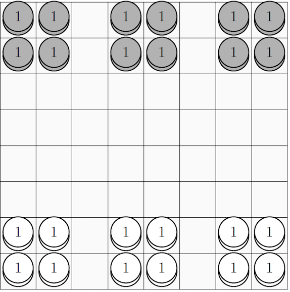

# Expendibots
Expendibots is an adversarial game played in a 8x8 board(For concrete rules see [here](game/game-rule.md)) implemented in Python.
An [Reinforcement Learning Agent](game/agent) using approximate Q learning algorithm is implemented to play this game.



## Play the game
In the `/game` directory, run the following command to specify 2 agents(black and white) to battle with each other:
```
python -m referee <white> <black>
```
for example, let the q-learning agent to play against itself with:
```
python -m referee agent agent
```
or play with the agent with your input for every action:
```
python -m referee agent test
```

## Approximate Q-learning Agent
See [here](game/readme.md) for implementation details of the q-learning agent.

## Search Problem
In `search` module, the game is simplified into a search problem in which the goal is to eliminate all black token. An
weighted A* search algorithm is implemented to solve the problem, along with the comparison with other search algorithm
such as breath-first search, A* search. See [here](search/readme.md) for more implementation details.

Run the search agent with a specified test case
```
python -m search search-test-cases/test-level-5.json
```
