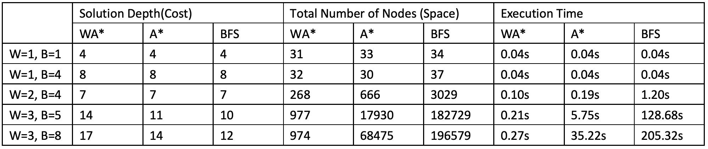

## COMP30024 AI Project A Report

Wenhao Zhang 970012
Yiyang Jin 966255

### Problem Formulation

The game *Expendibots* has following properties: *observable*, *deterministic*, *sequential*, *static*, and *discrete*, which allow the solution to be seen as a sequence of actions. And therefore, we can transform it into a search problem as follows:

- State:
  The state of the board is determined by the position of token stacks and the number and color of the token in each of those stacks. We use a dictionary to record the state, in which the key is the stack position, and value is the number and color of tokens. Empty cells should not be included so that every state of the board can be uniquely represented.  
  For example, the board with 2 black tokens on the upper left corner and 1 white tokens on upper right corner can be represented by `{(0, 0): "⚫, 2", (7, 7): "⚪, 1"}`.  
  In python, we use a `set` to store the board dictionaries that we have explored to avoid duplicated states, and every state should also include its parent pointer and the last action it took, so that we can trace back from the final state and find the path.
- Actions:
  The valid actions of a state consist of all the moves of movable stacks and booms of every white stack. We use a tuple to represent an action:
  - MOVE: `(n, x, y, dx, dy)`, where n is the number of tokens moved, (x, y) is the start position, and (dx,dy) is the destination.
  - BOOM: `(0, x, y, 0, 0)`, where x, y is the position of the stack that booms.
- Goal test: Check whether the board is clear of the black token.
- Path cost: Every single step cost 1, so the path cost is the number of steps in the path

### Search Algorithms: Weighted A* Search

We adopted the weighted A* search to solve the problem. A* search is an informed search algorithm that keeps examining the nodes with the least cost estimation. A* algorithm uses the evaluation function $f(n) = g(n) + h(n)$ to estimate the cost for node $n$ to reach the goal, where $g(n)$ is the cost from the start node to node $n$, and $h(n)$ is the estimated cost for node $n$ to reach the goal.

#### Heuristic Function

In our implementation, the heuristic function returns the number of remaining black stacks in the current state. In practice, the cost $g(n)$ can easily get greater than $h(n)$, which makes heuristic value not significant enough to guide the search, therefore we use weighted A* search with coefficient `10` to enhance the heuristic function $f(n) = g(n) + 10·h(n)$.

#### Benefits: complexity and completeness

- Space Complexity and Time Complexity:
  Technically in the worst case, both of the space complexity and time complexity can be $O(b^d)$, where $b$ is the branching factor, and $d$ is the path depth. In practice, the heuristic function prunes out most of the branches and way more faster than blind search and A* search. We'll talk about how much does it improve time and space complexity in the  next section.
- Completeness:
  As our search space is a finite tree with non-negative edges, the weight A* will eventually find the solution as long as it exists.

#### Constraints: inadmissible and non-optimal

Nevertheless, the number of the remaining black stacks can be more than the actual remaining cost (e.g. one boom can eliminate 10 black stacks as long as they are connected), it violates the principle $h(n) <= h^*(n)$ for admissible heuristics and does not guarantee an optimal solution. We will address more details of this problem in the next section.

### Influencing Factors of Time and Space

The following table shows how much the performance of WA* has improved comparing to that of the Breath First Search and the A* search. The first 4 rows record the data yielded using the given test cases and the 5th row is from a more complex mutant of the level-4 test. 

According to the game rule, the branching factor is determined by the valid actions of each state, more white stacks or more tokens in a stack will produce more valid actions in one state. Knowing the solution produced by BFS is the optimal, we can see that both the number of white tokens and the length of the minimal solution can significantly affect the time and space complexity.

#### Occasions that our algorithm works better 

Generally, our algorithms works better with complicated initial board environments than with simple ones. Our heuristic directs the search to eliminate the black stacks as soon as possible. It works well when there are a large amount of black stacks, especially discrete ones, which usually suggesting a higher difficulty level. As we can see in row 4 & 5, WA* expands 200 times fewer nodes than BFS and can complete every test within 1s. However, it does not produce optimal solutions. This is a trade-off we made between optimality and efficiency.

#### Occasions that our algorithm works less satisfactory 

As the heuristic only takes effect when a white stack reach a black stack, it works like a blind search when searching for black stacks before encountering them. For example, given the inputs of `test-level-1` , a simple case contains only one white token and one black token, our algorithm behaves almost the same as BFS as the heuristic value won't change before the white token reaches the black token. However, in such simple cases, even BFS is fast enough to produce a solution, then our algorithm is totally acceptable.

#### Conclusion

In short, our strategy is to wipe out the close and easy black stacks in early stage to simplified the problem, and use simple blind search to handle the rest.
